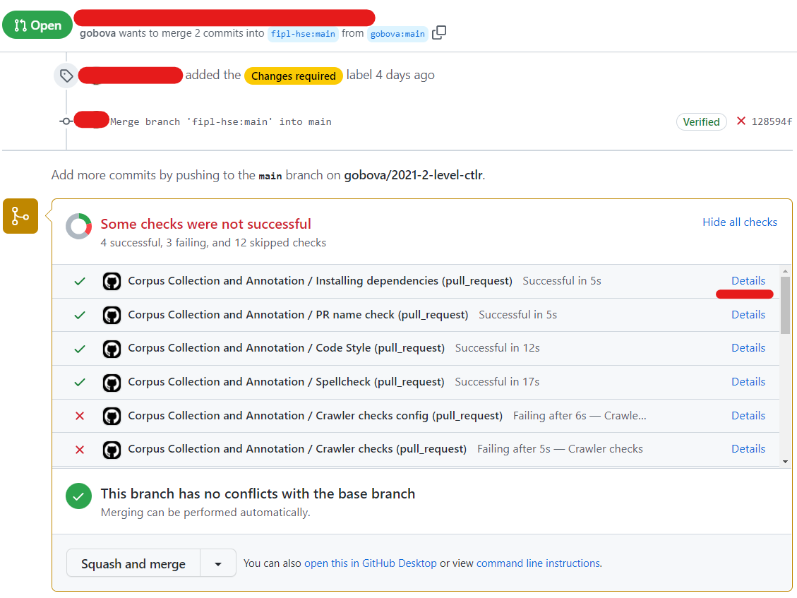
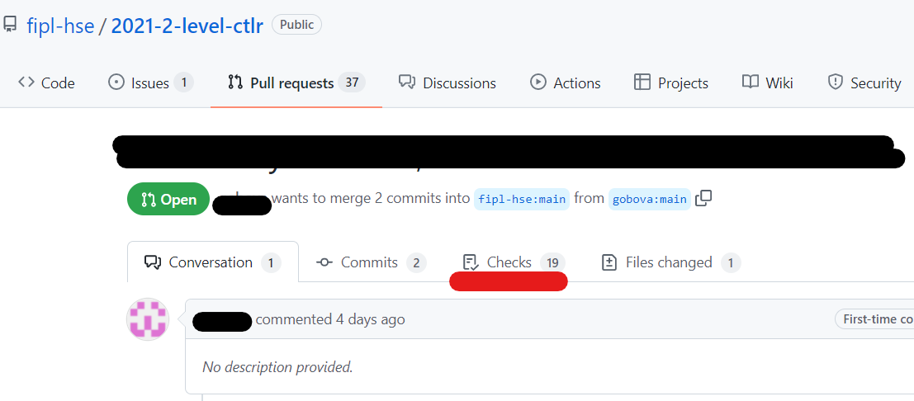

.. _running-tests-label:

Working with tests: locally and in CI
=====================================

Running tests locally with PyCharm
----------------------------------

To configure tests locally you need to perform several steps:

1. Install tests dependencies:

   .. code:: bash

      python -m pip install -r requirements_qa.txt

.. important:: Ensure you have activated your environment
               if you have such by running ``.\venv\Scripts\activate``
               (Windows) or ``source venv\bin\activate`` (macOS).

2. Create a new configuration:

   .. image:: ../images/tests/pycharm_create_configuration.jpg

3. Choose ``pytest`` as a target:

   .. image:: ../images/tests/pycharm_choose_pytest_template.jpg

4. Fill ``pytest`` configuration and click ``OK``:

   .. image:: ../images/tests/pycharm_fill_pytest_configuration.jpg

5. Run ``pytest`` configuration:

   .. image:: ../images/tests/pycharm_run_pytest.jpg

   This should run all the tests in the repository. You can inspect them
   by clicking through a list at the bottom of a screen.

   .. image:: ../images/tests/pycharm_tests_report.png

6. As you have some tests failing, you want to debug them. Then, first,
   you need to limit a scope of running tests and the mark level you
   want to get for an assignment. For example, you might want to run
   checks for a crawler configuration. Then you need to return to
   configuration menu and pass additional parameters, like
   ``-m stage_2_1_crawler_config_check``.

   .. image:: ../images/tests/pycharm_control_tests_scope.jpg

   You can choose any of the labels that are described in
   ``../pyproject.toml`` and combine with a mark.
   For example, running the aforementioned check for configuration
   for a mark 8 will look like
   ``-m "mark8 and stage_2_1_crawler_config_check"``.

.. hint:: To running all tests for first assignment for mark 8:
          ``-m "mark8 and (stage_2_1_crawler_config_check or stage_2_2_crawler_check or stage_2_3_HTML_parser_check or stage_2_4_dataset_volume_check or stage_2_5_dataset_validation)"``

.. hint:: When you want to debug a test, instead of running them, put
          a breakpoint at the potentially vulnerable place of code and execute
          debugging by clicking a ‘bug’ button.

Running tests in command-line
-----------------------------

1. Install dependencies (assuming you have activated the environment
   from the previous step):

   .. code:: bash

      python -m pip install -r requirements_qa.txt

2. Run the tests for the given mark. You can select any level:
   ``mark4``, ``mark6``, ``mark8``, ``mark10``:

   .. code:: bash

      python -m pytest -m mark8

Running tests in CI
-------------------

Tests will never run until you create a Pull Request.

The very first check happens exactly when you create a pull request.
After that, each time you push changes in your fork, CI check will be
automatically started, normally within a minute or two. To see the
results, navigate to your PR and click either the particular step in the
report at the end of a page, or click **Checks** in the toolbar.

Inspect each step by clicking through the list to the left.
