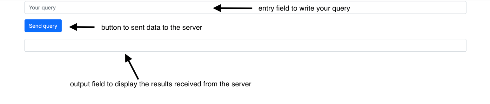

Laboratory work №7. Large Language Models no. 1
===============================================

.. toctree::
    :maxdepth: 1
    :titlesonly:
    :caption: Full API

    lab_7_llm.api.rst
    ../core_utils/llm/core_utils_llm.api.rst

**Python competencies required to complete this tutorial:**
    * working with Transformers models;
    * working with HuggingFace datasets;
    * estimating result using metric;
    * making server for the chosen task using FastAPI.

**Model pipeline contains the following steps:**

    1. Downloading the chosen dataset from HuggingFace.
    2. Retrieving dataset's properties.
    3. Preprocessing dataset.
    4. Retrieving model properties.
    5. Get prediction for one sample from dataset.
    6. Get predictions for the whole dataset.
    7. Saving predictions.
    8. Estimating results with metric.
    9. Implementing server.

Motivation and purpose
----------------------

In this laboratory work we will be introduced to Large Language Models
and learn how to apply them to solve different tasks.

**Large Language Model (LLM)** - is a deep-learning algorithm that
can perform a variety of Natural Language Processing tasks.

The life cycle of LLM encompasses several distinct phases,
from its inception to deployment and potential retraining.
However, let's look at the two main phases:

    1. **Training** - phase when model learns from a labeled dataset,
       adjusting its internal parameters (weights and biases) based on
       the input data and corresponding target outputs. The ultimate goal
       of training is to enable the model to generalize well to unseen data,
       capturing underlying patterns and relationships within the training dataset.
    2. **Inference** - phase that occurs after the model has been trained
       and is ready to make predictions on new, unseen data.
       During inference, the trained model takes input data and produces
       output predictions without further adjusting its internal parameters.

Thus, *training* a model requires a huge corpus of text,
usually hundreds of gigabytes of text collected from various sources.
This process is complex, computationally intensive and time-consuming.
At the same time, *inference* is less computationally intensive and
its goal is to provide fast and efficient response to queries.

**The primary purpose** of this laboratory work is to learn
how to apply LLMs to solve different tasks: Generation, Summarization, Classification,
Natural Language Inference and Neural Machine Translation.
We will not train models for the reasons outlined above,
but rather we will make inferences.

Technical solution
------------------

+------------------------------------+----------------------------------------+------+
|     Module                         | Description                            | Mark |
+====================================+========================================+======+
| `pandas                            | working with DataFrame                 | 4    |
| <https://pandas.pydata.org/        |                                        |      |
| docs/index.html>`__                |                                        |      |
+------------------------------------+----------------------------------------+------+
| `datasets                          | loading dataset from HuggingFace       | 4    |
| <https://huggingface.co/           |                                        |      |
| docs/datasets/index>`__            |                                        |      |
+------------------------------------+----------------------------------------+------+
| `torch <https://pytorch.org/>`__   | machine learning framework             | 6    |
+------------------------------------+----------------------------------------+------+
| `transformers                      | library providing easy                 | 6    |
| <https://huggingface.co/           | APIs to work with models               |      |
| docs/transformers/index>`__        |                                        |      |
+------------------------------------+----------------------------------------+------+
| `torchinfo                         | getting model properties               | 6    |
| <https://github.com/               |                                        |      |
| TylerYep/torchinfo>`__             |                                        |      |
+------------------------------------+----------------------------------------+------+
| `evaluate                          | evaluating model performance           | 8    |
| <https://huggingface.co/           |                                        |      |
| docs/evaluate/index>`__            |                                        |      |
+------------------------------------+----------------------------------------+------+
| `FastAPI                           | implementing a WEB-service             | 10   |
| <https://fastapi.tiangolo.com/>`__ |                                        |      |
+------------------------------------+----------------------------------------+------+

.. important:: ``torch`` module needs to be installed using
               ``--extra-index-url https://download.pytorch.org/whl/cpu``
               in ``requirements.txt`` file.

Configuring model
-----------------

Model behavior is fully defined by a configuration file that is called ``settings.json``
and it is placed on the same level as ``main.py``.

+----------------------------+------------------------------------------------+--------------+
| Config parameter           | Description                                    | Type         |
+============================+================================================+==============+
| ``parameters``             |Set up parameters for laboratory work           | ``dict``     |
+----------------------------+------------------------------------------------+--------------+
| ``parameters.model``       |Name of the the chosen model                    | ``str``      |
+----------------------------+------------------------------------------------+--------------+
| ``parameters.dataset``     |Name of the dataset                             | ``str``      |
+----------------------------+------------------------------------------------+--------------+
| ``parameters.metrics``     |Name of the metrics used for the chosen task    | ``list[str]``|
+----------------------------+------------------------------------------------+--------------+
|``target_score``            |Desired mark for laboratory work                | ``int``      |
+----------------------------+------------------------------------------------+--------------+

Assessment criteria
-------------------

You state your ambitions on the mark by editing ``target_score`` parameter in
``settings.json`` file. Possible values are 4, 6, 8, and 10. For example, 6
would mean that you have made tasks for mark 6 and request mentors to check
if you can get it. See mark requirements and explanations below:

1. Desired mark **4**:
    1. ``pylint`` level: **5/10**.
    2. The script downloads dataset and retrieves its properties.
2. Desired mark **6**:
    1. ``pylint`` level: **7/10**.
    2. All requirements for the mark **4**.
    3. The script preprocesses dataset, retrieves model properties
       and infers model on one sample from dataset.
3. Desired mark **8**:
    1. ``pylint`` level: **10/10**.
    2. All requirements for the mark **6**.
    3. The script infers model on the whole dataset and evaluates the model performance.
4. Desired mark **10**:
    1. ``pylint`` level: **10/10**;
    2. All requirements for the mark **8**.
    3. Implement model as a service.

Implementation tactics
----------------------

Stage 0. Start working on the laboratory work
~~~~~~~~~~~~~~~~~~~~~~~~~~~~~~~~~~~~~~~~~~~~~

Start your implementation by selecting a model and dataset you are going to use.
You can find all available combinations
in the `table <https://docs.google.com/spreadsheets/d/1_GTEa3RUkOqdZ82q1SrD7YkOeV3fr8APNcUAC6o0K4M/edit?usp=sharing>`__.

.. note:: All logic for instantiating and using needed abstractions
          should be implemented in a ``main()`` function of a ``start.py`` module.

To do this, implement the functions in the ``main.py`` module
and import them into ``start.py``.

.. code:: py

   if __name__ == '__main__':
       main()

.. note:: You need to set the desired mark: 4, 6, 8 or 10 in the ``target_score`` field
          in the ``settings.json`` file. The higher the desired mark, the more
          number of tests run when checking your Pull Request.

Stage 1. Introduce importer abstraction: ``RawDataImporter``
~~~~~~~~~~~~~~~~~~~~~~~~~~~~~~~~~~~~~~~~~~~~~~~~~~~~~~~~~~~~

First of all, you need to import the chosen HuggingFace dataset.

To download your dataset inside your program you need to implement
:py:class:`lab_7_llm.main.RawDataImporter` abstraction.

This class inherits from
:py:class:`core_utils.llm.raw_data_importer.AbstractRawDataImporter` abstraction,
which has the following internal attributes:

    * ``self._hf_name`` - string with the name of the HuggingFace dataset;
    * ``self._raw_data`` - downloaded pd.DataFrame.

.. important:: To get data from ``RawDataImporter`` abstraction, use
               :py:attr:`core_utils.llm.raw_data_importer.AbstractRawDataImporter.raw_data` property.

.. note:: Property is a method with a ``@property`` decorator
          that can be accessed like a field.

See the intended instantiation:

.. code:: py

    importer = RawDataImporter(settings.parameters.dataset)

where ``settings.parameters.dataset`` is the name of the HuggingFace dataset
written in ``settings.json`` file.

Stage 1.1. Download dataset
"""""""""""""""""""""""""""

Implement :py:meth:`lab_7_llm.main.RawDataImporter.obtain` method
which allows to download dataset and fill ``self._raw_data`` attribute.

You have to use
`load_dataset() <https://huggingface.co/docs/datasets/v2.15.0/en
/package_reference/loading_methods#datasets.load_dataset>`__ function
from ``datasets`` module.

.. important:: In our laboratory work we are going to get predictions of the model,
               so you have to download ``validation`` or ``test`` split of the
               chosen dataset by filling the parameter ``split`` of
               the ``load_dataset()`` function. Also for some datasets you need
               to select a specific subset. You can always find out
               if you need to do this in the appropriate task card.

.. note:: If downloaded dataset is not ``pd.DataFrame``, method raises ``TypeError``.

.. note:: ``obtain()`` method has ``@report_time`` decorator
          which you will also find in many other methods
          in this laboratory work. The purpose of this
          decorator is to log time spent on method execution.

Stage 2. Introduce preprocessor abstraction: ``RawDataPreprocessor``
~~~~~~~~~~~~~~~~~~~~~~~~~~~~~~~~~~~~~~~~~~~~~~~~~~~~~~~~~~~~~~~~~~~~

Before putting the dataset into the model we have to analyze and preprocess it.

To perform all needed preprocessing and analyze your dataset
inside your program you need to implement
:py:class:`lab_7_llm.main.RawDataPreprocessor` abstraction.

This class inherits from
:py:class:`core_utils.llm.raw_data_preprocessor.AbstractRawDataPreprocessor` abstraction,
which has the following internal attributes:

    * ``self._raw_data`` - downloaded pd.DataFrame;
    * ``self._data`` - preprocessed pd.DataFrame.

.. important:: To get processed data from ``RawDataPreprocessor`` abstraction, use
               :py:attr:`core_utils.llm.raw_data_preprocessor.AbstractRawDataPreprocessor.data` property.

See the intended instantiation:

.. code:: py

    preprocessor = RawDataPreprocessor(importer.raw_data)

where ``importer.raw_data`` is the property of the ``RawDataImporter`` class.

Stage 2.1. Analyze dataset properties
"""""""""""""""""""""""""""""""""""""

We will start with analyzing your **raw** dataset.
In general, analyzing a dataset before loading it into the model
allows you to understand its structure, data quality
and identify potential problems such as missing values or outliers.
This helps to better prepare your data, improve model performance
and increase forecast accuracy.

Implement :py:meth:`lab_7_llm.main.RawDataPreprocessor.analyze`
method which allows to analyze raw dataset.

Method should return a dictionary with the following dataset properties.

+-------------------------------+----------------------------------------+---------+
|    Name                       | Description                            | Type    |
+===============================+========================================+=========+
| ``dataset_number_of_samples`` | Number of samples in dataset           | ``int`` |
+-------------------------------+----------------------------------------+---------+
| ``dataset_columns``           | Number of columns in dataset           | ``int`` |
+-------------------------------+----------------------------------------+---------+
| ``dataset_duplicates``        | Number of duplicates in dataset        | ``int`` |
+-------------------------------+----------------------------------------+---------+
| ``dataset_empty_rows``        | Number of empty rows in dataset        | ``int`` |
+-------------------------------+----------------------------------------+---------+
| ``dataset_sample_min_len``    | Minimal length of the dataset sample   | ``int`` |
|                               | in ``source`` column(s)                |         |
+-------------------------------+----------------------------------------+---------+
| ``dataset_sample_max_len``    | Maximal length of the dataset sample   | ``int`` |
|                               | in ``source`` column(s)                |         |
+-------------------------------+----------------------------------------+---------+

.. note:: **Why find the maximum and minimum dataset sample length?**
          If you are working with text, knowing the maximum sample length
          allows you to determine the maximum length of text your model can handle.
          This is important for correctly defining model parameters,
          such as the maximum length of the input sequence.
          While a minimum sample length may indicate the presence
          of incomplete or incorrect data.

.. important:: Before calculating minimal and maximal length of the dataset sample,
               drop empty rows in the dataset.

Stage 2.2. Demonstrate the result in ``start.py``
"""""""""""""""""""""""""""""""""""""""""""""""""

.. important:: **Stages 0 - 2.2** are required to get the mark **4**.

Demonstrate your dataset analysis
in the ``main()`` function of the ``start.py`` module.

Stage 2.3. Preprocess dataset
"""""""""""""""""""""""""""""

Preprocessing the dataset before loading it into the model is an important step.
Data cleaning, label coding and more contribute to the quality and efficiency of the model,
allowing it to better extract patterns from the data.

Implement method
:py:meth:`lab_7_llm.main.RawDataPreprocessor.transform`
which allows to preprocess dataset.

.. important:: You can find all needed preprocessing for your
               combination of model and dataset choosing appropriate task:

                   * :ref:`classification-label`
                   * :ref:`generation-label`
                   * :ref:`nli-label`
                   * :ref:`nmt-label`
                   * :ref:`summarization-label`

.. note:: According to preprocessing instructions in task cards,
          you should change column names. To do this use fields of the
          :py:class:`core_utils.llm.raw_data_preprocessor.ColumnNames` abstraction.

Save your preprocessed dataset to ``self._data`` attribute.

Stage 3. Introduce dataset abstraction: ``TaskDataset``
~~~~~~~~~~~~~~~~~~~~~~~~~~~~~~~~~~~~~~~~~~~~~~~~~~~~~~~

To work with the model we will use PyTorch
`Dataset <https://pytorch.org/docs/stable/data.html#torch.utils.data.Dataset>`__ abstraction.
We convert ``pd.Dataframe`` to ``Dataset``, because in the next step
we will use PyTorch ``DataLoader`` abstraction, which will allow us
to efficiently load the data into the model's memory,
process it in batches and pass it to the model.

Implement :py:class:`lab_7_llm.main.TaskDataset` abstraction
to convert ``pd.DataFrame`` to ``Dataset`` and override some methods.

This class inherits from ``torch.utils.data.Dataset`` abstraction,
which has one internal attribute:

    * ``self._data`` - ``pd.DataFrame`` with preprocessed data.

.. important:: When instantiating ``TaskDataset``
               abstraction in ``start.py`` module,
               limit the full ``pd.DataFrame`` you got
               from ``RawDataPreprocessor`` to the first 100 samples.

See the intended instantiation:

.. code:: py

    dataset = TaskDataset(preprocessor.data.head(100))

where ``preprocessor.data`` is the property of the ``RawDataPreprocessor`` class.

Stage 3.1. Get the dataset length
"""""""""""""""""""""""""""""""""

In the next two steps, we will override some methods
that will allow us to further work with PyTorch ``DataLoader`` abstraction.

Implement :py:meth:`lab_7_llm.main.TaskDataset.__len__` method
which allows to get the number of items in dataset.
PyTorch ``DataLoader`` uses this method
to determine the total number of batches in an epoch.

Stage 3.2. Retrieve an item from the dataset
""""""""""""""""""""""""""""""""""""""""""""

Implement :py:meth:`lab_7_llm.main.TaskDataset.__getitem__` method
which allows to retrieve an item from the dataset by index.

PyTorch ``DataLoader`` calls this method to retrieve data for each batch.
Implementing this method allows you to define how the data is retrieved
from the dataset and how it is structured.
It should return a tuple containing items
from columns with text to be retrieved.
Depending on the task, the number of columns may vary.

Stage 3.3. Retrieve data
""""""""""""""""""""""""

Implement :py:attr:`lab_7_llm.main.TaskDataset.data` property
which allows to access the preprocessed ``pd.DataFrame``.

Stage 4. Introduce model pipeline abstraction: ``LLMPipeline``
~~~~~~~~~~~~~~~~~~~~~~~~~~~~~~~~~~~~~~~~~~~~~~~~~~~~~~~~~~~~~~

Now we are ready to run our model.

To initialize our model, analyze its properties,
infer model on the whole dataset and one sample from it you need to implement
:py:class:`lab_7_llm.main.LLMPipeline` abstraction.

This class inherits from
:py:class:`core_utils.llm.llm_pipeline.AbstractLLMPipeline` abstraction,
which has the following internal attributes:

    * ``self._model_name`` - a string with the model name;
    * ``self._model`` - the model instance;
    * ``self._dataset`` - ``Dataset`` instance;
    * ``self._device`` - a string with a device type (``cpu``);
    * ``self._tokenizer`` - the tokenizer instance suitable for your model;
    * ``self._batch_size`` - an integer with batch size;
    * ``self._max_length`` - an integer with maximum length of generated sequence.

.. note:: When loading a model and tokenizer, you will import special
          `Auto Classes <https://huggingface.co/docs/transformers/model_doc/auto>`__.
          However, for some models and tokenizers you can use special classes
          that are based on the architecture of the pre-trained model.
          You can find out which class you need to use
          through the ``architectures`` parameter of the model ``config`` object.

See the intended instantiation:

.. code:: py

    pipeline = LLMPipeline(settings.parameters.model, dataset, max_length, batch_size, device)

where ``settings.parameters.model`` is the name of the model
written in ``settings.json`` and ``dataset`` is an instance of ``TaskDataset`` abstraction.

Stage 4.1. Analyze model properties
"""""""""""""""""""""""""""""""""""

Implement method
:py:meth:`lab_7_llm.main.LLMPipeline.analyze_model`
which allows to analyze model properties.

Method should return a dictionary with the following model properties.

+---------------------------+------------------------------------------+---------+
|    Name                   | Description                              | Type    |
+===========================+==========================================+=========+
| ``input_shape``           | Represents the dimensions of the         | ``dict``|
|                           | input data of the model.                 | or      |
|                           | In our laboratory work it contains       | ``list``|
|                           | batch size and maximum context length    |         |
|                           | of the model.                            |         |
|                           | For example, ``"input_shape": [1, 512]`` |         |
+---------------------------+------------------------------------------+---------+
| ``embedding_size``        | Embedding size of the model              | ``int`` |
+---------------------------+------------------------------------------+---------+
| ``output_shape``          | Represents the dimensions of the         | ``list``|
|                           | output data of the model.                |         |
|                           | For example,                             |         |
|                           | ``"output_shape": [1, 512, 59514 ]``     |         |
+---------------------------+------------------------------------------+---------+
| ``num_trainable_params``  | Number of trainable parameters           | ``int`` |
|                           | in the model                             |         |
+---------------------------+------------------------------------------+---------+
| ``vocab_size``            | Vocabulary size of the model             | ``int`` |
+---------------------------+------------------------------------------+---------+
| ``size``                  | Number of parameters                     | ``int`` |
+---------------------------+------------------------------------------+---------+
| ``max_context_length``    | Maximum context length of the model      | ``int`` |
+---------------------------+------------------------------------------+---------+

To get the part of the model properties, you have to use
`summary() <https://github.com/TylerYep/torchinfo?tab=readme-ov-file#documentation>`__
method from ``torchinfo`` module.
This method returns an instance of ``ModelStatistics`` class.
For this lab you will need the following fields from this class:

    * ``input_size``
    * ``summary_list``
    * ``trainable_params``
    * ``total_param_bytes``

Stage 4.2. Infer one sample from dataset
""""""""""""""""""""""""""""""""""""""""

Implement method
:py:meth:`lab_7_llm.main.LLMPipeline.infer_sample`,
which allows to infer one sample from dataset.

.. note:: If the model is not defined, method returns **None**.

Stage 4.3. Demonstrate the result in ``start.py``
"""""""""""""""""""""""""""""""""""""""""""""""""

.. important:: **Stages 2.3 - 4.3** are required to get the mark **6**.

Demonstrate model properties analysis and dataset sample inference
in the ``main()`` function of the ``start.py`` module.

As parameters for initialization ``LLMPipeline`` abstraction,
use:

    * ``batch_size`` = 1;
    * ``max_length`` = 120;
    * ``device`` = 'cpu'.

.. note:: For generation task use ``max_length`` = 512.

Stage 4.4. Infer dataset
""""""""""""""""""""""""

Implement method
:py:meth:`lab_7_llm.main.LLMPipeline.infer_dataset`,
which allows to infer the dataset.

While iterating through dataset samples,
use PyTorch `Dataloader <https://pytorch.org/docs/stable/data.html#torch.utils.data.DataLoader>`__.
It requires two parameters: ``dataset`` and ``batch_size``.

The DataLoader class provides efficient data loading
by allowing the user to load data in parallel using multiple CPU cores.
This can significantly reduce the data loading time,
especially for large datasets.

.. note:: When using tokenizer, set parameters
          ``padding=True``, ``truncation=True`` to handle varying sequence lengths.

Method returns ``pd.DataFrame`` with ``target`` and ``predictions`` columns.

Stage 4.5. Infer batch
""""""""""""""""""""""

LLMs typically work with datasets with thousands of samples.
Consequently, iterating through these datasets one sample at a
time proves highly inefficient, particularly when considering
that each batch conceptually aligns with the inference on a single sample.

Also, you may have already noticed that
there is some duplication in methods
:py:meth:`lab_7_llm.main.LLMPipeline.infer_sample`
and :py:meth:`lab_7_llm.main.LLMPipeline.infer_dataset`.

To be able to eliminate all aforementioned problems
first you need to implement method
:py:meth:`lab_7_llm.main.LLMPipeline._infer_batch`
which allows to infer a single batch.

.. note:: There are going to be a few peculiarities
         when implementing method for generation task.
         You can find them in :ref:`generation-label`.

.. important:: You have to rewrite ``infer_sample()`` and ``infer_dataset()`` methods
               so that these methods use ``_infer_batch()`` method.

Stage 5. Introduce evaluation abstraction: ``TaskEvaluator``
~~~~~~~~~~~~~~~~~~~~~~~~~~~~~~~~~~~~~~~~~~~~~~~~~~~~~~~~~~~~

Now we have our predictions and can evaluate obtained result.

To be able to evaluate the performance of the model
with appropriate metrics you need to implement
:py:class:`lab_7_llm.main.TaskEvaluator` abstraction.

This class inherits from
:py:class:`core_utils.llm.task_evaluator.AbstractTaskEvaluator` abstraction,
which has the following internal attributes:

    * ``self._metrics`` - a field of
      :py:class:`core_utils.llm.metrics.Metrics` abstraction
      with suitable metric;
    * ``self._data_path`` - a string with the path to the ``predictions.csv`` file.

See the intended instantiation:

.. code:: py

    evaluator = TaskEvaluator(predictions_path, settings.parameters.metrics)

where ``predictions_path`` is a string with the path to the ``predictions.csv`` file,
``settings.parameters.metrics`` is the name of the suitable metric
written in ``settings.json`` file.

Stage 5.1. Evaluate model performance
"""""""""""""""""""""""""""""""""""""

Implement method
:py:meth:`lab_7_llm.main.TaskEvaluator.run`
which allows to evaluate the predictions against the
references using the specified metric.

.. note:: To evaluate model performance using special metric you have to use
         `load() <https://huggingface.co/docs/evaluate/main/
         en/package_reference/loading_methods#evaluate.load>`__ method from ``evaluate`` module.

.. important:: There are some additional parameters for **Summarization** task
               which you can find in :ref:`summarization-label`.

.. note:: To compute the metrics you have to use
          `compute() <https://huggingface.co/docs/datasets/v2.15.0/
          en/package_reference/main_classes#datasets.Metric.compute>`__
          method from ``evaluate`` module.

Stage 5.2. Demonstrate the result in ``start.py``
"""""""""""""""""""""""""""""""""""""""""""""""""

.. important:: **Stages 4.4 - 5.2** are required to get the mark **8**.

Demonstrate dataset inference and model performance evaluation
in the ``main()`` function of the ``start.py`` module.

.. important:: Set parameter ``batch_size`` = 64.

.. note:: After dataset inference you have to save
          you predictions to ``predictions.csv`` file in ``start.py``.

Stage 6. Implement Model as a Service
~~~~~~~~~~~~~~~~~~~~~~~~~~~~~~~~~~~~~

The next step after making an LLM pipeline is the implementation
of a `FastAPI <https://fastapi.tiangolo.com/>`__ service utilizing Transformers
for the chosen task. Implementing a service allows
to see how LLMs can be deployed and integrated into practical applications.

.. note:: For example, if you have chosen the **NMT** task,
          your service should accept sentence in one language
          and return translated sentence.

.. important:: All logic should be implemented in the following modules:

                   * ``service.py``
                   * ``assets/index.html``
                   * ``assets/main.js``
                   * ``assets/styles.css``

Stage 6.1. Initialize core application
""""""""""""""""""""""""""""""""""""""

Let's start implementing the service with initialisation
all needed instances for a pipeline and web-service.
To do this, implement
:py:meth:`lab_7_llm.service.init_application` method.

.. important:: Remember, you have to implement your service using
              ``FastAPI`` web framework.

To initialize the service, you need to create ``FastAPI`` instance
and a handler for statistical files from ``assets`` directory
where the implementation of the service interface will be stored.
Also, as parameters for initialization a pipeline use
values from **Stage 4.3** and **Stage 5.2**.

Stage 6.2. Make root endpoint
"""""""""""""""""""""""""""""

**Root endpoint** is the base URL of your service,
where start web page with user interface for the service will be located.

Some important points about user interface implementation:

    * Your start page should be made using
      `Jinja <https://jinja.palletsprojects.com/en/3.1.x/>`__
      templating engine in ``assets/index.html`` file;
    * The request from the HTML page must be performed
      using `JavaScript <https://learn.javascript.ru/>`__ in ``assets/main.js`` file.
      Then you will import it into ``assets/index.html`` file;
    * CSS markup should be put in ``assets/styles.css`` file.

Let's look at the implementation of the request
from the HTML page in a little more detail.
The code of the request should be placed inside
an event listener for the button click event.
Specifically, you should call the asynchronous
`fetch() <https://learn.javascript.ru/fetch>`__ method.

Fill the ``options`` parameter of ``fetch()`` method with properties:

    * ``method`` - corresponding to the one in ``FastAPI``;
    * ``headers`` - appropriate for sending ``JSON``;
    * ``body`` - containing a ``JSON`` request as a string.

The request's ``JSON`` structure should match the
expected format in your ``FastAPI`` service
so that the query can be correctly processed.

So, an example of start page might look like this:

And now we are ready to implement
:py:meth:`lab_7_llm.service.root` method
which allows to create a root endpoint of the service.
The method should return an HTML page using ``TemplateResponse``
which renders an HTML page based on a specific template and passed data.
Before that you need to create a template using
``Jinja2Templates`` with ``assets`` directory and
call :py:meth:`lab_7_llm.service.init_application` method.

.. note:: Use ``@app.get("/")``
          decorator to create a route for the root URL.

Stage 6.2. Make main endpoint
"""""""""""""""""""""""""""""

When a user clicks the button on the start page,
a POST request must be initiated to the main endpoint
which is responsible for processing the data using LLM pipeline.

Implement :py:meth:`lab_7_llm.service.infer` method
which allows to create a main endpoint for model call.

To make a query in an ``entry field`` you need to implement
:py:class:`lab_7_llm.service.Query` abstraction
with ``question`` field which contains text of the query.
Use ``@dataclass`` decorator from ``pydantic`` module.

Response obtained as a result of the pipeline
will be displayed in the ``output field``.
Response should be in the form of the **dictionary**
with ``infer`` key and the value containing response.

.. note:: Use ``@app.post("/infer")``
          decorator to create a route for the main endpoint URL.

Stage 6.3. Demonstrate the result
"""""""""""""""""""""""""""""""""

.. important:: **Stage 6** is required to get the mark **10**.

Demonstrate work of your service by running a server
implemented in ``service.py`` module and obtaining one sample inference result.

.. note:: You can run you server using ``uvicorn PATH:app --reload`` command,
          where ``PATH`` is a path to ``service.py`` module.
